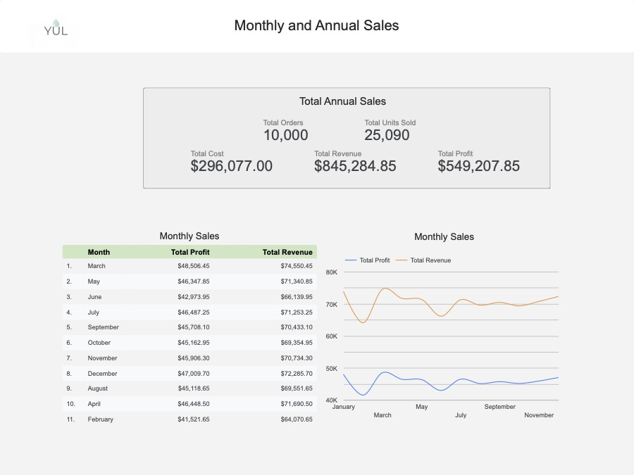
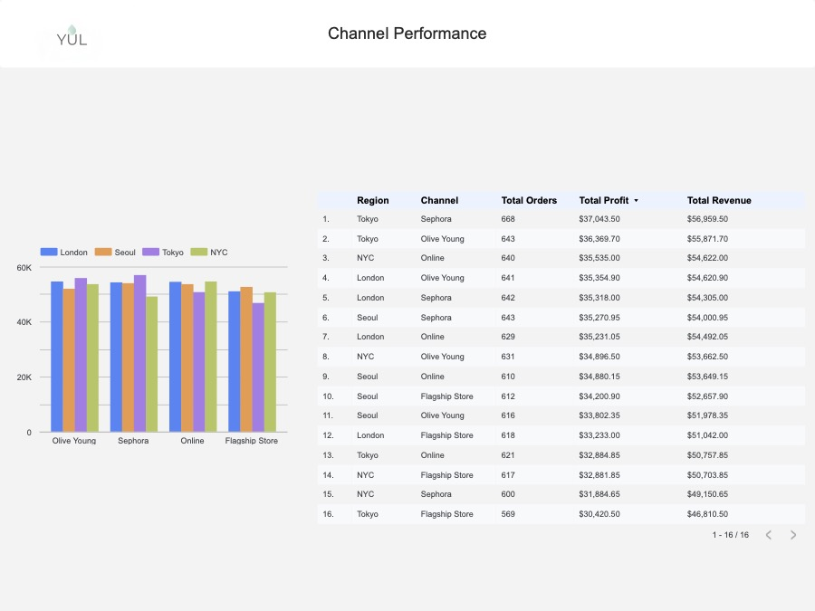
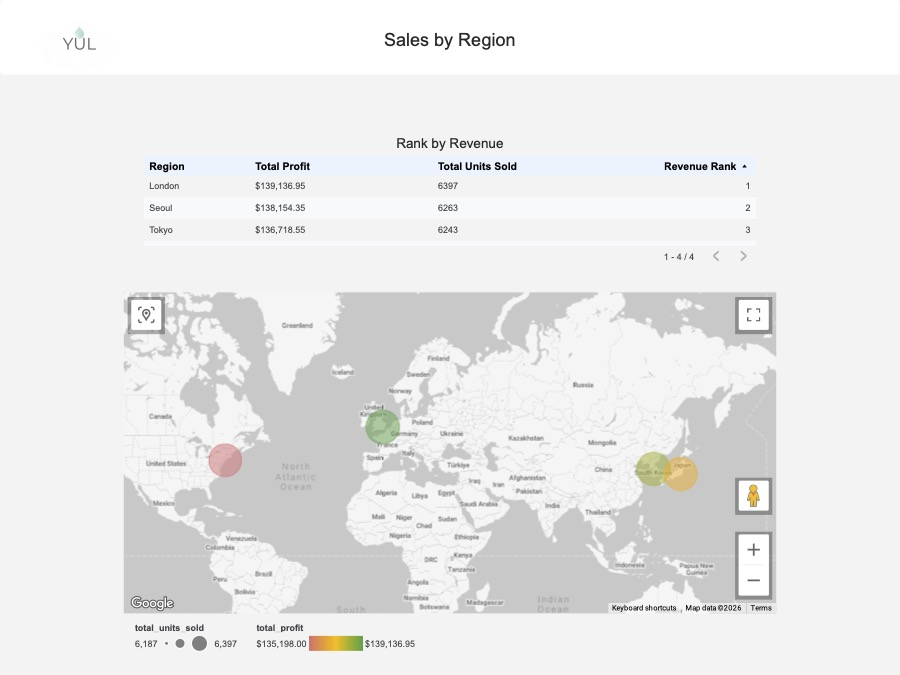
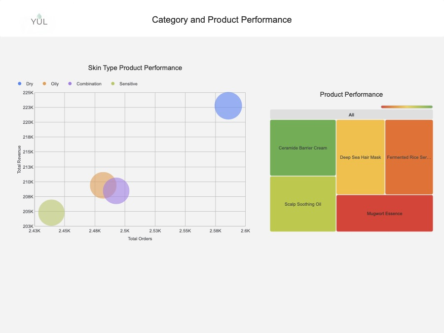
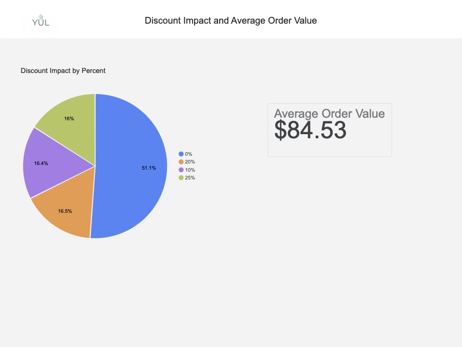

# YUL Retail Wellness Sales Analytics (2025)
<p align="center">
  
</p>

[](https://github.com/users/alfimerino/projects/4)

[](https://datastudio.google.com/s/hcQGSLVweMk)

## Project Overview

This project analyzes 2025 sales data for a wellness brand focused on hair and facial care products. The goal is to uncover actionable business insights across different regions and sales channels, and present them through a structured analytics pipeline using SQL and Google Data Studio. This project will assist business stakeholder (e.g., Head of Sales or Marketing) needs clear answers to questions about performance, trends, and growth opportunities.

## Executive Overview
This comprehensive data audit analyzes global retail operations, channel efficiencies, geographic performance, product catalog dynamics, and promotional strategies across **10,000 total transactions**. The business demonstrates strong foundational health, high-margin stability, and uniform brand equity across international markets.

---

## Key Findings & Portfolio Insights

### 1. Financial Performance & Seasonality
<p align="center">
  
</p>
* **High-Margin Baseline:** The operation generated **$845,284.85** in total revenue against a total cost of goods sold (COGS) of **$296,077.00**. This reflects an exceptionally strong **65% gross profit margin**, delivering **$549,207.85** in total net profit.
* **Volume Stability & Peak Cycles:** Monthly performance is highly stable, with 7 out of 12 months tightly clustered in the **$45K to $46K** profit range. Peak earnings occur in Q1, led by March ($48.5K profit) and January ($48.0K profit). 
* **Seasonal Slump:** A predictable post-holiday dip occurs in February, hitting the annual profit floor of **$41,521.65** before sharply recovering.

### 2. Global Geographic Footprint
<p align="center">
  
</p>
The business model is highly resilient and geographically diversified. The performance variance between the top-performing and lowest-performing global hubs is remarkably narrow:
* **London (Rank #1):** The volume and profit champion, securing **$139,136.95** in profit and leading with **6,397 units sold**.
* **NYC (Rank #4):** The baseline market, generating **$135,198.00** in profit and **6,187 units sold**.
* **Strategic Takeaway:** A minor **$3,938.95 profit gap** and a mere **210-unit volume differential** separate the highest and lowest regions. No single city carries the business; risk is perfectly spread across North America, Europe, and Asia.

### 3. Retail & Digital Channel Efficiency
<p align="center">
  
</p>
When isolating performance by sales channel, a distinct multi-channel hierarchy emerges:
* **Olive Young B2B Placements:** The most consistent and reliable revenue vector globally, consistently generating $51K–$55K per city, anchored by **Tokyo Olive Young** at **$55,871.70**.
* **Direct-to-Consumer (DTC) Online:** Highly uniform digital revenue across London, NYC, and Seoul ($53.6K–$54.6K). Tokyo Online represents a slight trailing anomaly ($50.7K), identifying a key target for localized digital marketing optimization.
* **Sephora Partnerships:** The most volatile channel layer. It encompasses the single highest-grossing segment in the entire ecosystem (**Tokyo Sephora at $56,959.50**) but also one of the weakest (**NYC Sephora at $49,150.65**).

### 4. Product Catalog & Customer Segment Dynamics
<p align="center">
  
</p>
* **The Flagship Core:** The **Ceramide Barrier Cream** is the undisputed hero product of the catalog, capturing the largest individual share of inventory volume and revenue.
* **Customer Persona High-Value Vector:** **Dry Skin** is the ultimate powerhouse customer segment, driving the highest order volume (~2,600) and top-line revenue (>$220K). This directly correlates with the success of barrier-repair products.
* **Volume vs. Value Gaps:** **Oily** and **Combination** skin profiles generate high transaction volumes (~2,500 orders each) but lower average order spend (~$207K–$210K), indicating that these users favor lower-priced items or smaller size variations. **Sensitive Skin** remains a lower-volume boutique segment.

### 5. Promotional Strategy & Basket Size (AOV)
<p align="center">
  
</p>
* **Organic Brand Premium:** **51.1% of total revenue** is generated entirely at **0% discount (Full Price)**. The business demonstrates strong organic customer demand and is not discount-dependent to drive baseline volume.
* **Promotional Efficiency:** The **10% discount tier** (16.4% revenue share) and the **20% discount tier** (16.5% revenue share) yield virtually identical top-line market penetration. 
* **Strategic Takeaway:** The 10% promotional tier is twice as efficient, capturing identical consumer demand while preserving an additional 10% of gross margin. 
* **Basket Metrics:** The healthy global **Average Order Value (AOV) of $84.53**, combined with an average of 2.5 units per transaction, confirms that consumers are actively building out multi-step product routines rather than buying single commodity items.

## Business Questions

This analysis answers key questions such as:
- Which regions generated the most revenue?
- How do different sales channels perform (Local, Online, Sephora)?
- What are the monthly sales trends?
- Which product categories drive the most revenue?
- Where are the biggest opportunities for growth?
  
## Tech Stack
- Database: Azure SQL
- Querying: SQL (Views for analytics layer)
- Visualization: Google Data Studio
- Version Control: GitHub

## Project Structure
```
/sql        → SQL scripts (views, transformations)
/data       → Raw dataset (CSV)
/dashboard    → Google Data Studio dashboard file (.pbix)
/docs       → Screenshots and documentation
```

## Data Overview
The dataset represents sales transactions from 2025.
### Key Fields:
- `Order_ID` – Order Identifier 
- `Date` – Order Date 
- `Product_ID` – Product Identifier 
- `Product_Name` – Product Name (Char)
- `Category` – Product Type: Hair, Skin (Char)
- `Quantity` – Product count purchased in Order 
- `Unit_Cost` – Product Sales Cost 
- `Unit_Price` – Product Sales Price 
- `Discount` – Order discount applied (Percent)
- `Channel` – Location type where order was placed: Online: Sephora, Online, Flagship Store, Olive Young
- `Region` – Geographic Location where order was placed: London, Tokyo, NYC, Seoul
- `Skin_Type` – Categorizes products based on the targeted skin profile, such as Oily, Dry, Combination, or Sensitive.

## SQL Analytics Layer
To keep the reporting layer clean and efficient, reusable SQL views were created.
### Key Views:
- `total_sales` → Overall revenue and units sold
- `sales_by_region` → Regional performance ranking
- `sales_by_store_type` → Channel comparison
- `monthly_sales` → Time-based trends
- `top_categories` → Product performance
- `region_store_performance` → Combined breakdown
These views act as a semantic layer between raw data and Google Data Studio.

## Infrastructure Profile: 
### Component: Backend 
Azure SQL Database was provisioned as a cloud-native Azure SQL Database to serve as the primary data warehouse for the Yul Analytics retail engine. The environment is configured using a Serverless compute model, ensuring high performance during data processing while minimizing operational costs through automated pausing during idle periods.

### Azure Resource Identity
* **SQL Server:** `yul-retail-server`
* **Database:** `YulRetailDB`
* **Resource Type:** `microsoft.sql/servers`
* **Deployment ID:** ` /subscriptions/b15c1074-cb99-4f48-b670-2d6a8b0065a8/resourceGroups/yul-retail/providers/Microsoft.Sql/servers/yul-retail-server/databases/YulRetailDB `

### Technical Specifications
- Service Tier: General Purpose Serverless (Gen5)
- Compute Power: 2 vCores (Auto-scaling from 0.5 min)
- Storage: 32 GB Max (Local Redundancy)
- Region: Central US (centralus)
- Collation: SQL_Latin1_General_CP1_CI_AS
- Cost Management: Auto-pause enabled (60-minute delay)

## Google Data Studio Dashboard
[Data Studio Dashboard](https://datastudio.google.com/s/hcQGSLVweMk)

### Features:
KPI cards for total revenue and units sold
Sales by region (bar chart)
Store type comparison (channel performance)
Monthly sales trend (line chart)
Filters for region, store type, and category

## AI Use Case (Optional)
This project can be extended with tools like Microsoft Copilot or ChatGPT to allow business users to ask questions such as:
“What region had the highest sales?”
“Show me monthly trends for online sales”
These tools can translate natural language into SQL queries against the analytics views.
